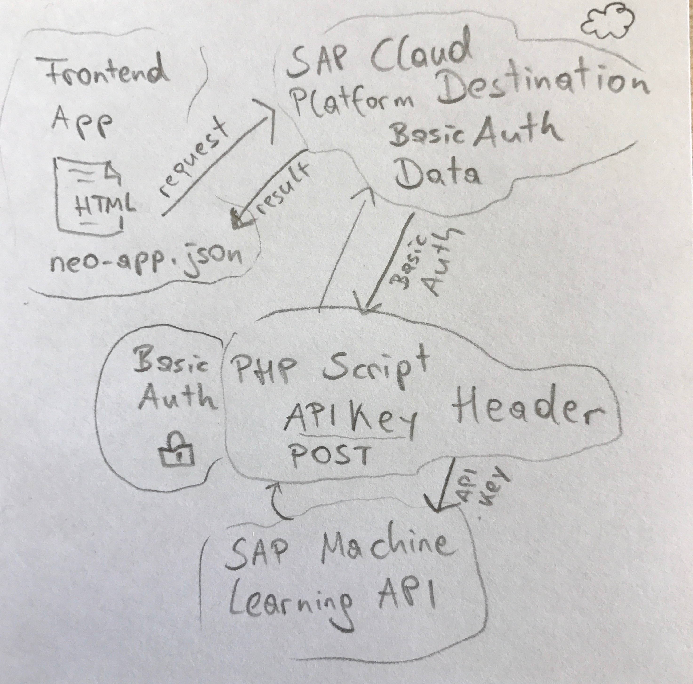

# php-proxy-sap-machinelearning-api
A PHP proxy for the SAP machine learning API which needs an APIKey header, secured via BasicAuth.

## WHY??
Inside the SAP Cloud Platorm destination service I can maintain a URL to the SAP Machine Learning APIs, but I can't provide an APIKey header field which is required. So I let a PHP script handle this APIKey header field and I secured this script via BasicAuth and maintained the connection to this script inside the destination service.

I saw an example where the APIKey via front-end coding, but as stated there, this is not secure: [SAPUI5 Translation Hub](https://blogs.sap.com/2017/06/06/scpta-exercise-2-add-logic-to-your-ui-in-sap-web-ide/).

So I was looking for another solution - and here it is! :-)

PHP you ask? There is a [Java Proxy Servlet](https://github.com/SAP/cloud-connectivityproxy), but I still don't speak Java, no Maven know how, no Eclipse on my machine... I speak JavaScript and PHP and have a webspace - so this should be sufficient. May in the future I write a node.js app and deploy it to the SAP Cloud Foundry trial.

## Architecture
Here you see a high level diagram how the front end calls the the SAP Cloud Platform destination service who stores the BasicAuth data for the PHP script, calls the PHP script, which calls the SAP Machine Learning API with the APIKey header field.

## Info 1
The **php** file (no extenstion) is the destination file for the SAP Cloud Platform Connectivity.

The **index.html** and **neo-app.json** need to be inside your SAP Web IDE and and can be deployed to the SAP Cloud Platform. 

The **.htaccess** and **apitranslate.php** need to be deployed to your own webspace. Provide your own API key inside the **apitranslate.php** file.

The **apitranslate.php** file is secured via basic auth, you maintain user and password inside the destination in the SAP Cloud Platform and inside this file. This file finally sends the request to the SAP Leonardo Machine Learning API including the API Key inside the header.

## Info 2
This was completely Stack Overflow driven development. May hacky, but it works.
